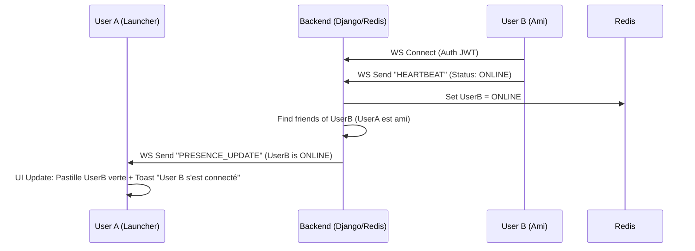

# Spécification Technique : Système Social & Amis (V2)

Ce document décrit en détail l'implémentation du module Social pour JeuxCracks.
L'objectif est d'atteindre un niveau de qualité "Steam/Discord" avec une communication temps réel.

## 1. Architecture Temps Réel (High Level)

Pour offrir une expérience fluide ("L'ami se connecte, je le vois instantanément"), nous ne pouvons pas nous reposer uniquement sur des requêtes HTTP classiques (polling).

*   **Django Channels (WebSockets)** : Pour le push d'informations (Notification d'ami, Message reçu, Changement de statut).
*   **Redis** : Pour stocker l'état "Live" des utilisateurs (En ligne / Hors ligne / En jeu) sans écrire en base de données SQL à chaque seconde.
*   **REST API** : Pour les actions "froides" (Lister les amis, Envoyer une demande, Bloquer).

---

## 2. Modèles de Données (Django)

### A. Friendship (Relation Amicale)

Nous ne stockons ici que les relations *persistantes*.

```python
class Friendship(models.Model):
    user_from = models.ForeignKey(User, related_name='friendships_sent', on_delete=models.CASCADE)
    user_to = models.ForeignKey(User, related_name='friendships_received', on_delete=models.CASCADE)
    status = models.CharField(
        max_length=20, 
        choices=['PENDING', 'ACCEPTED', 'BLOCKED'], 
        default='PENDING'
    )
    created_at = models.DateTimeField(auto_now_add=True)
    updated_at = models.DateTimeField(auto_now=True)

    class Meta:
        unique_together = ('user_from', 'user_to')
        # Index pour optimiser les recherches "qui sont mes amis ?"
```

### B. ChatMessage (Messagerie Privée)

```python
class ChatMessage(models.Model):
    sender = models.ForeignKey(User, related_name='messages_sent', on_delete=models.CASCADE)
    receiver = models.ForeignKey(User, related_name='messages_received', on_delete=models.CASCADE)
    content = models.TextField()
    timestamp = models.DateTimeField(auto_now_add=True)
    is_read = models.BooleanField(default=False)
```

---

## 3. Gestion de la Présence (Redis)

Plutôt que SQL, nous utilisons Redis pour la rapidité des mises à jour fréquentes (toutes les 30s).

**Structure dans Redis :**
*   Clé : `user_presence:{user_id}`
*   Valeur (JSON) :
    ```json
    {
        "status": "ONLINE", // ONLINE, IDLE, DND (Do Not Disturb), IN_GAME, OFFLINE
        "game_id": "12345", // Optionnel, si en jeu
        "game_title": "Elden Ring",
        "last_ping": "2023-10-27T10:00:00Z"
    }
    ```
*   TTL (Time To Live) : 60 secondes. Si le launcher ne ping pas, l'utilisateur passe automatiquement hors ligne.

---

## 4. API REST (Endpoints)

Ces endpoints sont utilisés par le Launcher pour gérer la liste d'amis.

### A. Gestion des Amis

*   **`GET /api/social/friends/`**
    *   **Réponse** : Liste des amis acceptés + leur statut Redis injecté à la volée.
    *   *Payload* : `[{ "id": 1, "pseudo": "Dafi", "status": "IN_GAME", "game": "GTA V" }, ...]`

*   **`POST /api/social/friends/request/`**
    *   **Body** : `{ "username": "TargetUser" }`
    *   **Action** : Crée une `Friendship` (PENDING) + Notifie via WebSocket la cible.

*   **`POST /api/social/friends/respond/`**
    *   **Body** : `{ "request_id": 42, "action": "ACCEPT" | "REJECT" }`
    *   **Action** : Met à jour le statut. Si ACCEPT, notifie l'envoyeur via WS.

*   **`DELETE /api/social/friends/{user_id}/`**
    *   **Action** : Supprime l'ami.

### B. Historique de Chat

*   **`GET /api/social/chat/{friend_id}/history/?limit=50&offset=0`**
    *   **Réponse** : Liste des messages passés.

---

## 5. WebSockets (Gateway Temps Réel)

Endpoint unique : `ws://api.jeuxcracks.fr/ws/gateway/`

Le client s'y connecte au démarrage (avec son Token JWT pour l'auth).

### A. Events reçus par le Client (S -> C)

1.  **`FRIEND_REQUEST`**
    *   Payload : `{ "from": { "id": 12, "pseudo": "Pote", "avatar": "url..." } }`
    *   *UI* : Afficher une notif "Pote vous a envoyé une demande d'ami".

2.  **`PRESENCE_UPDATE`**
    *   Payload : `{ "user_id": 12, "status": "IN_GAME", "game_title": "Cyberpunk 2077" }`
    *   *UI* : Mettre à jour la pastille de couleur dans la liste d'amis instantanément.

3.  **`CHAT_MESSAGE`**
    *   Payload : `{ "sender_id": 12, "content": "Salut ça va ?", "timestamp": "..." }`
    *   *UI* : Afficher le message dans la fenêtre de chat.

### B. Events envoyés par le Client (C -> S)

1.  **`HEARTBEAT` (Ping)**
    *   Payload : `{ "type": "PING", "status": "ONLINE" | "IN_GAME", "game_id": "xyz" }`
    *   *Serveur* : Met à jour Redis et diffuse `PRESENCE_UPDATE` aux amis de l'user.

2.  **`SEND_MESSAGE`**
    *   Payload : `{ "type": "chat_message", "to": 15, "content": "Viens jouer !" }`
    *   *Serveur* : Enregistre SQL + Relaye via WS au destinataire.

---

## 6. Diagramme de Flux (Exemple: Connexion d'un ami)



## 7. Plan d'Implémentation

1.  **Backend (Django)**
    *   Créer l'app `social`.
    *   Implémenter `Friendship` model et API Views.
    *   Configurer `django-channels` et Redis.
    *   Créer le `SocialConsumer` (WS).

2.  **Client (Electron/Vue)**
    *   Créer `SocialStore` (Pinia) pour gérer la liste d'amis.
    *   Créer `WebSocketService` (Singleton) pour gérer la connexion WS persistante.
    *   Intégrer les notifications visuelles.
