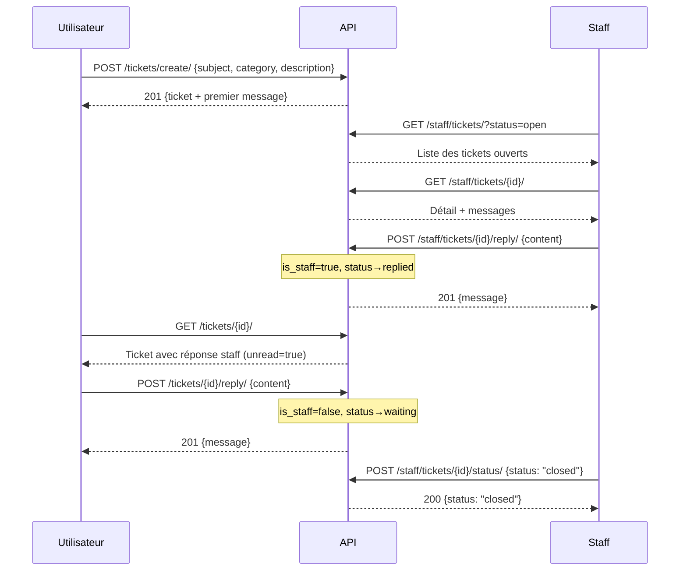

# 📘 API Support (Tickets) — JeuxCracks

> **Base URL** : `https://api.jeuxcracks.fr/api/support/`
> **Auth** : JWT Bearer Token (sauf mention contraire)

---

## 📑 Sommaire

### Endpoints Utilisateur

| # | Endpoint | Méthode | Auth | Description |
|---|----------|---------|------|-------------|
| 1 | `/tickets/` | GET | ✅ | Lister mes tickets |
| 2 | `/tickets/create/` | POST | ✅ | Créer un ticket |
| 3 | `/tickets/{id}/` | GET | ✅ | Détail d'un ticket |
| 4 | `/tickets/{id}/reply/` | POST | ✅ | Répondre à un ticket |
| 5 | `/tickets/{id}/close/` | POST | ✅ | Fermer un ticket |
| 6 | `/tickets/{id}/reopen/` | POST | ✅ | Rouvrir un ticket |

### Endpoints Staff

| # | Endpoint | Méthode | Auth | Description |
|---|----------|---------|------|-------------|
| 7 | `/staff/tickets/` | GET | 🔒 Staff | Tous les tickets |
| 8 | `/staff/tickets/{id}/` | GET | 🔒 Staff | Détail d'un ticket |
| 9 | `/staff/tickets/{id}/reply/` | POST | 🔒 Staff | Répondre en tant que staff |
| 10 | `/staff/tickets/{id}/status/` | POST | 🔒 Staff | Changer le statut |

---

## 🔐 Authentification

Tous les endpoints nécessitent un header :
```
Authorization: Bearer <JWT_ACCESS_TOKEN>
```

Les endpoints **🔒 Staff** nécessitent en plus que `user.is_staff = True`.

---

## 📦 Modèles

### Ticket

| Champ | Type | Description |
|-------|------|-------------|
| `id` | int | ID unique |
| `subject` | string | Sujet du ticket (max 200) |
| `category` | string | `download`, `account`, `premium`, `bug`, `suggestion`, `other` |
| `priority` | string | `basse`, `moyenne`, `haute` |
| `status` | string | `open`, `replied`, `waiting`, `closed` |
| `user_pseudo` | string | Pseudo de l'utilisateur (lecture seule) |
| `last_message` | string | Aperçu du dernier message (80 chars, lecture seule) |
| `unread` | boolean | `true` si le dernier message vient du staff |
| `created_at` | datetime | Date de création |
| `updated_at` | datetime | Dernière mise à jour |

### TicketMessage

| Champ | Type | Description |
|-------|------|-------------|
| `id` | int | ID unique |
| `content` | string | Contenu du message |
| `is_staff` | boolean | `true` si réponse du staff |
| `created_at` | datetime | Date du message |

---

## 🧑 Endpoints Utilisateur

### 1. Lister mes tickets

```
GET /api/support/tickets/
```

**Auth** : ✅ Requise

**Query params** :

| Param | Type | Description |
|-------|------|-------------|
| `status` | string | `open` (inclut waiting), `replied`, `closed` |
| `q` | string | Recherche dans le sujet |

**Réponse** `200` :
```json
[
  {
    "id": 1,
    "subject": "Problème téléchargement",
    "category": "download",
    "priority": "moyenne",
    "status": "open",
    "created_at": "2026-02-28T10:00:00Z",
    "updated_at": "2026-02-28T10:00:00Z",
    "last_message": "Le lien ne fonctionne pas pour GTA V...",
    "unread": false,
    "user_pseudo": "gamer42"
  }
]
```

---

### 2. Créer un ticket

```
POST /api/support/tickets/create/
```

**Auth** : ✅ Requise

**Body** :
```json
{
  "subject": "Problème téléchargement",
  "category": "download",
  "priority": "moyenne",
  "description": "Le lien ne fonctionne pas pour GTA V, erreur 404."
}
```

| Champ | Type | Requis | Description |
|-------|------|--------|-------------|
| `subject` | string | ✅ | Sujet (max 200 chars) |
| `category` | string | ✅ | `download`, `account`, `premium`, `bug`, `suggestion`, `other` |
| `priority` | string | ❌ | `basse`, `moyenne` (défaut), `haute` |
| `description` | string | ✅ | Premier message du ticket |

**Réponse** `201` :
```json
{
  "id": 1,
  "subject": "Problème téléchargement",
  "category": "download",
  "priority": "moyenne",
  "status": "open",
  "created_at": "2026-02-28T10:00:00Z",
  "updated_at": "2026-02-28T10:00:00Z",
  "messages": [
    {
      "id": 1,
      "content": "Le lien ne fonctionne pas pour GTA V, erreur 404.",
      "is_staff": false,
      "created_at": "2026-02-28T10:00:00Z"
    }
  ]
}
```

---

### 3. Détail d'un ticket

```
GET /api/support/tickets/{id}/
```

**Auth** : ✅ Requise

**Réponse** `200` :
```json
{
  "id": 1,
  "subject": "Problème téléchargement",
  "category": "download",
  "priority": "moyenne",
  "status": "replied",
  "created_at": "2026-02-28T10:00:00Z",
  "updated_at": "2026-02-28T12:00:00Z",
  "messages": [
    {
      "id": 1,
      "content": "Le lien ne fonctionne pas pour GTA V, erreur 404.",
      "is_staff": false,
      "created_at": "2026-02-28T10:00:00Z"
    },
    {
      "id": 2,
      "content": "Le lien a été corrigé, merci de réessayer.",
      "is_staff": true,
      "created_at": "2026-02-28T12:00:00Z"
    }
  ]
}
```

**Erreurs** :

| Code | Raison |
|------|--------|
| `404` | Ticket introuvable ou ne vous appartient pas |

---

### 4. Répondre à un ticket

```
POST /api/support/tickets/{id}/reply/
```

**Auth** : ✅ Requise

**Body** :
```json
{
  "content": "Le problème persiste toujours."
}
```

> Le statut du ticket passe automatiquement à `waiting`.

**Réponse** `201` :
```json
{
  "id": 3,
  "content": "Le problème persiste toujours.",
  "is_staff": false,
  "created_at": "2026-02-28T14:00:00Z"
}
```

**Erreurs** :

| Code | Raison |
|------|--------|
| `400` | Message vide |
| `404` | Ticket introuvable |

---

### 5. Fermer un ticket

```
POST /api/support/tickets/{id}/close/
```

**Auth** : ✅ Requise — **Body** : vide

**Réponse** `200` :
```json
{
  "status": "closed"
}
```

---

### 6. Rouvrir un ticket

```
POST /api/support/tickets/{id}/reopen/
```

**Auth** : ✅ Requise — **Body** : vide

**Réponse** `200` :
```json
{
  "status": "open"
}
```

---

## 🔒 Endpoints Staff

> Nécessitent `user.is_staff = True`. Retournent `403` si l'utilisateur n'est pas staff.

### 7. Lister tous les tickets (Staff)

```
GET /api/support/staff/tickets/
```

**Auth** : 🔒 Staff

**Query params** :

| Param | Type | Description |
|-------|------|-------------|
| `status` | string | `open` (inclut waiting), `replied`, `closed` |
| `category` | string | `download`, `account`, `premium`, `bug`, `suggestion`, `other` |
| `priority` | string | `basse`, `moyenne`, `haute` |
| `q` | string | Recherche dans le sujet |

**Réponse** `200` : Même format que l'endpoint utilisateur, mais avec **tous** les tickets.

---

### 8. Détail d'un ticket (Staff)

```
GET /api/support/staff/tickets/{id}/
```

**Auth** : 🔒 Staff

**Réponse** `200` : Même format que l'endpoint utilisateur (ticket + messages).

---

### 9. Répondre en tant que staff

```
POST /api/support/staff/tickets/{id}/reply/
```

**Auth** : 🔒 Staff

**Body** :
```json
{
  "content": "Le lien a été corrigé, merci de réessayer."
}
```

> Le message est marqué `is_staff: true` et le statut passe à `replied`.

**Réponse** `201` :
```json
{
  "id": 2,
  "content": "Le lien a été corrigé, merci de réessayer.",
  "is_staff": true,
  "created_at": "2026-02-28T12:00:00Z"
}
```

---

### 10. Changer le statut (Staff)

```
POST /api/support/staff/tickets/{id}/status/
```

**Auth** : 🔒 Staff

**Body** :
```json
{
  "status": "closed"
}
```

| Valeur | Description |
|--------|-------------|
| `open` | Rouvert |
| `replied` | Répondu par le staff |
| `waiting` | En attente de réponse staff |
| `closed` | Fermé |

**Réponse** `200` :
```json
{
  "status": "closed"
}
```

**Erreurs** :

| Code | Raison |
|------|--------|
| `400` | Statut invalide |
| `404` | Ticket introuvable |

---

## 📐 Flux type


