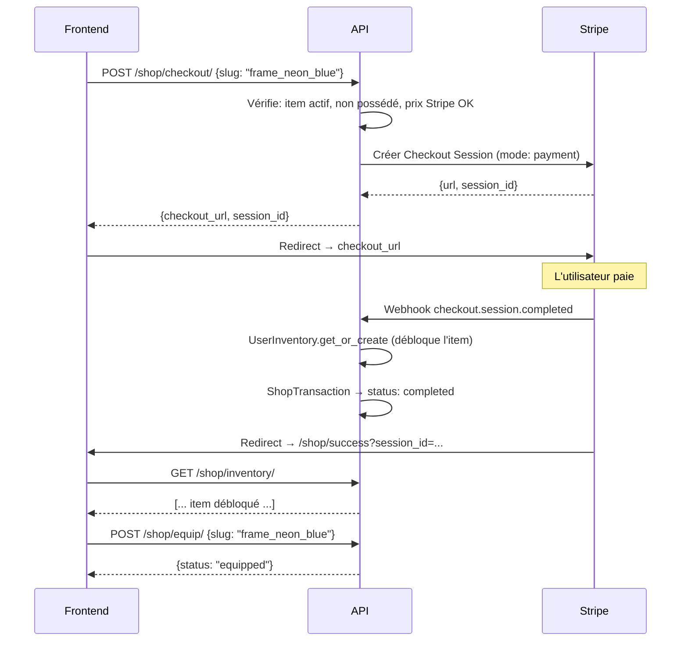

# 📘 API Boutique (Shop) — JeuxCracks

> **Base URL** : `https://api.jeuxcracks.fr/api/shop/`
> **Webhook** : `https://api.jeuxcracks.fr/api/webhooks/shop/`
> **Auth** : JWT Bearer Token (sauf mention contraire)

---

## 📑 Sommaire

| # | Endpoint | Méthode | Auth | Description |
|---|----------|---------|------|-------------|
| 1 | `/items/` | GET | ❌ | Catalogue des items |
| 2 | `/items/{slug}/` | GET | ❌ | Détail d'un item |
| 3 | `/inventory/` | GET | ✅ | Inventaire du user |
| 4 | `/equipment/` | GET | ✅ | Équipement actuel |
| 5 | `/equip/` | POST | ✅ | Équiper un item |
| 6 | `/unequip/` | POST | ✅ | Retirer un item |
| 7 | `/checkout/` | POST | ✅ | Créer session Stripe |
| 8 | `/webhooks/shop/` | POST | Stripe | Webhook paiement |

---

## 🔐 Authentification

Endpoints marqués ✅ nécessitent :
```
Authorization: Bearer <JWT_ACCESS_TOKEN>
```

---

## 📦 Modèles

### ShopItem

| Champ | Type | Description |
|-------|------|-------------|
| `slug` | string | Identifiant unique (ex: `frame_neon_blue`) |
| `name` | string | Nom affiché |
| `description` | string | Description |
| `type` | string | `avatar_frame`, `banner`, `pseudo_effect`, `global_theme` |
| `rarity` | string | `common`, `rare`, `epic`, `legendary`, `mythic` |
| `price` | string | Prix formaté (ex: `"2.99€"`) |
| `price_cents` | int | Prix en centimes (ex: `299`) |
| `css_class` | string | Classe CSS pour le rendu |
| `image_url` | string | URL de l'image (si non CSS) |
| `is_css_only` | boolean | `true` = rendu CSS, `false` = image |
| `is_new` | boolean | Badge "Nouveau" |
| `owned` | boolean | `true` si le user connecté possède l'item |

### Types d'items

| Type | Description | Slot équipement |
|------|-------------|-----------------|
| `avatar_frame` | Cadre autour de l'avatar | `avatar_frame` |
| `banner` | Bannière de profil | `banner` |
| `pseudo_effect` | Effet sur le pseudo | `pseudo_effect` |
| `global_theme` | Thème de l'interface | `global_theme` |

### Raretés

| Rareté | Couleur suggérée |
|--------|-----------------|
| `common` | Gris `#9e9e9e` |
| `rare` | Bleu `#2196f3` |
| `epic` | Violet `#9c27b0` |
| `legendary` | Or `#ff9800` |
| `mythic` | Rouge `#f44336` |

---

## 1. Catalogue des items

```
GET /api/shop/items/
```

**Auth** : ❌ Non requise

**Réponse** `200` :
```json
[
  {
    "slug": "frame_neon_blue",
    "name": "Néon Pulse",
    "description": "Un anneau néon bleu qui pulse.",
    "type": "avatar_frame",
    "rarity": "common",
    "price": "2.99€",
    "price_cents": 299,
    "css_class": "frame-neon-blue",
    "image_url": "",
    "is_css_only": true,
    "is_new": false,
    "owned": false
  },
  {
    "slug": "banner_fire",
    "name": "Flammes Infernales",
    "description": "Bannière animée de flammes.",
    "type": "banner",
    "rarity": "epic",
    "price": "4.99€",
    "price_cents": 499,
    "css_class": "banner-fire",
    "image_url": "",
    "is_css_only": true,
    "is_new": true,
    "owned": false
  }
]
```

> Le champ `owned` est `true` si l'utilisateur connecté possède l'item. Si non connecté, toujours `false`.

---

## 2. Détail d'un item

```
GET /api/shop/items/{slug}/
```

**Auth** : ❌ Non requise

**Réponse** `200` : même format qu'un item de la liste.

**Erreurs** :

| Code | Raison |
|------|--------|
| `404` | Item introuvable ou inactif |

---

## 3. Inventaire du user

```
GET /api/shop/inventory/
```

**Auth** : ✅ Requise

**Réponse** `200` :
```json
[
  {
    "item": {
      "slug": "frame_neon_blue",
      "name": "Néon Pulse",
      "description": "Un anneau néon bleu qui pulse.",
      "type": "avatar_frame",
      "rarity": "common",
      "price": "2.99€",
      "price_cents": 299,
      "css_class": "frame-neon-blue",
      "image_url": "",
      "is_css_only": true,
      "is_new": false,
      "owned": true
    },
    "purchased_at": "2026-03-01T05:30:00Z"
  }
]
```

---

## 4. Équipement actuel

```
GET /api/shop/equipment/
```

**Auth** : ✅ Requise

**Réponse** `200` :
```json
{
  "avatar_frame": "frame_neon_blue",
  "banner": null,
  "pseudo_effect": null,
  "global_theme": null
}
```

> Chaque slot contient le `slug` de l'item équipé, ou `null` si vide.

---

## 5. Équiper un item

```
POST /api/shop/equip/
```

**Auth** : ✅ Requise

**Body** :
```json
{
  "slug": "frame_neon_blue"
}
```

> L'item est automatiquement placé dans le bon slot selon son `type`.

**Réponse** `200` :
```json
{
  "status": "equipped",
  "type": "avatar_frame",
  "slug": "frame_neon_blue"
}
```

**Erreurs** :

| Code | Raison |
|------|--------|
| `400` | `slug` manquant |
| `403` | Item non possédé |

---

## 6. Retirer un item

```
POST /api/shop/unequip/
```

**Auth** : ✅ Requise

**Body** :
```json
{
  "type": "avatar_frame"
}
```

| Valeurs de `type` |
|-------------------|
| `avatar_frame` |
| `banner` |
| `pseudo_effect` |
| `global_theme` |

**Réponse** `200` :
```json
{
  "status": "unequipped",
  "type": "avatar_frame"
}
```

**Erreurs** :

| Code | Raison |
|------|--------|
| `400` | Type invalide |

---

## 7. Créer une session Stripe Checkout

```
POST /api/shop/checkout/
```

**Auth** : ✅ Requise

**Body** :
```json
{
  "slug": "frame_neon_blue"
}
```

**Réponse** `200` :
```json
{
  "checkout_url": "https://checkout.stripe.com/c/pay/cs_live_...",
  "session_id": "cs_live_..."
}
```

> **Usage** : Redirigez le frontend vers `checkout_url`. Après paiement, Stripe redirige vers la page de succès. L'item est débloqué automatiquement via webhook.

**Erreurs** :

| Code | Raison |
|------|--------|
| `400` | `slug` manquant, item déjà possédé, ou item sans prix Stripe |
| `404` | Item introuvable ou inactif |
| `500` | Erreur Stripe |

---

## 8. Webhook Stripe

```
POST /api/webhooks/shop/
```

**Auth** : Signature Stripe (`STRIPE_SHOP_WEBHOOK_SECRET`)

### Événements gérés

| Événement | Action |
|-----------|--------|
| `checkout.session.completed` | Crée `UserInventory` (débloque l'item) + met à jour `ShopTransaction` |

> Le webhook vérifie `metadata.type == "shop_purchase"` pour ne traiter que les achats boutique (pas les abonnements).

---

## 📐 Flux d'achat complet



---

## 🎨 Intégration Frontend

### Config API

```typescript
// Dans src/config/api.ts — ajouter dans ENDPOINTS :
SHOP: {
    ITEMS: '/api/shop/items/',
    ITEM_DETAIL: '/api/shop/items/',       // + {slug}/
    INVENTORY: '/api/shop/inventory/',
    EQUIPMENT: '/api/shop/equipment/',
    EQUIP: '/api/shop/equip/',
    UNEQUIP: '/api/shop/unequip/',
    CHECKOUT: '/api/shop/checkout/',
}
```

### Méthodes API

```typescript
// Dans src/services/api.ts :

// Catalogue (public)
static async getShopItems() {
    return useFetch(API_CONFIG.ENDPOINTS.SHOP.ITEMS);
}

static async getShopItem(slug: string) {
    return useFetch(`${API_CONFIG.ENDPOINTS.SHOP.ITEM_DETAIL}${slug}/`);
}

// Inventaire & Équipement (auth)
static async getInventory() {
    return useFetch(API_CONFIG.ENDPOINTS.SHOP.INVENTORY);
}

static async getEquipment() {
    return useFetch(API_CONFIG.ENDPOINTS.SHOP.EQUIPMENT);
}

static async equipItem(slug: string) {
    return useFetch(API_CONFIG.ENDPOINTS.SHOP.EQUIP, 'POST', { slug });
}

static async unequipItem(type: string) {
    return useFetch(API_CONFIG.ENDPOINTS.SHOP.UNEQUIP, 'POST', { type });
}

// Achat (auth)
static async buyItem(slug: string) {
    return useFetch(API_CONFIG.ENDPOINTS.SHOP.CHECKOUT, 'POST', { slug });
}
```

### Flux d'achat côté frontend

```typescript
async function handleBuy(slug: string) {
    const { data, error } = await JeuxCracksAPI.buyItem(slug);
    if (error) {
        toast.error(data.error);
        return;
    }
    // Redirect vers Stripe Checkout
    window.location.href = data.checkout_url;
}
```

### Afficher l'équipement sur le profil

```typescript
// Au chargement du profil :
const { data: equipment } = await JeuxCracksAPI.getEquipment();

// equipment = { avatar_frame: "frame_neon_blue", banner: null, ... }
// Appliquer la classe CSS correspondante :
if (equipment.avatar_frame) {
    avatarEl.classList.add(equipment.avatar_frame);
}
```

---

## 🔒 Points de sécurité

| Règle | Détail |
|-------|--------|
| Débloquage via webhook uniquement | Jamais depuis le frontend |
| Signature Stripe vérifiée | `stripe.Webhook.construct_event` |
| Idempotent | `get_or_create` empêche les doublons |
| Item possédé = vérifié côté serveur | `/equip/` vérifie l'inventaire |
| Prix dans Stripe | Le client n'envoie que le `slug`, jamais le prix |
