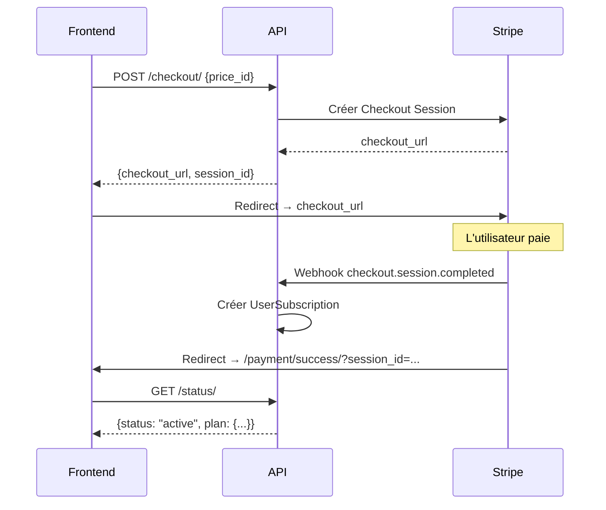

# 📘 API Subscriptions & Donations — JeuxCracks

> **Base URL** : `https://api.jeuxcracks.fr/api/subscriptions/`
> **Webhook** : `https://api.jeuxcracks.fr/api/webhooks/stripe/`
> **Auth** : JWT Bearer Token (sauf mention contraire)

---

## 📑 Sommaire

| # | Endpoint | Méthode | Auth | Description |
|---|----------|---------|------|-------------|
| 1 | `/plans/` | GET | ❌ | Lister les plans |
| 2 | `/checkout/` | POST | ✅ | Créer une session d'abonnement |
| 3 | `/status/` | GET | ✅ | État de l'abonnement |
| 4 | `/cancel/` | POST | ✅ | Annuler l'abonnement |
| 5 | `/reactivate/` | POST | ✅ | Réactiver l'abonnement |
| 6 | `/upgrade/` | POST | ✅ | Upgrade de plan |
| 7 | `/downgrade/` | POST | ✅ | Downgrade de plan |
| 8 | `/change-billing/` | POST | ✅ | Changer la période de facturation |
| 9 | `/invoices/` | GET | ✅ | Historique des factures |
| 10 | `/donate/` | POST | ✅ | Faire un don libre |
| 11 | `/donations/` | GET | ✅ | Historique des dons |
| 12 | `/revenue/monthly/` | GET | ❌ | Revenus du mois (public) |
| 13 | `/payment/success/` | GET | ❌ | Page de succès Stripe |
| 14 | `/payment/cancel/` | GET | ❌ | Page d'annulation Stripe |

---

## 🔐 Authentification

Tous les endpoints marqués ✅ nécessitent un header :
```
Authorization: Bearer <JWT_ACCESS_TOKEN>
```

---

## 1. Lister les plans

```
GET /api/subscriptions/plans/
```

**Auth** : ❌ Non requise

**Réponse** `200` :
```json
[
  {
    "id": 1,
    "name": "Basic Mensuel",
    "plan_type": "basic",
    "billing_period": "monthly",
    "stripe_price_id": "price_xxxxx",
    "is_active": true
  }
]
```

| Champ | Type | Description |
|-------|------|-------------|
| `plan_type` | string | `basic` ou `pro` |
| `billing_period` | string | `monthly` ou `yearly` |
| `stripe_price_id` | string | ID Stripe du prix |

---

## 2. Créer une session de checkout (abonnement)

```
POST /api/subscriptions/checkout/
```

**Auth** : ✅ Requise

**Body** :
```json
{
  "price_id": "price_xxxxx"
}
```

**Réponse** `200` :
```json
{
  "checkout_url": "https://checkout.stripe.com/c/pay/cs_live_...",
  "session_id": "cs_live_..."
}
```

**Erreurs** :
| Code | Raison |
|------|--------|
| `400` | Plan invalide, inactif, ou abonnement déjà actif |
| `500` | Erreur Stripe |

> **Usage** : Redirigez le frontend vers `checkout_url`.

---

## 3. État de l'abonnement

```
GET /api/subscriptions/status/
```

**Auth** : ✅ Requise

**Réponse** `200` (abonné) :
```json
{
  "id": 1,
  "plan": {
    "id": 1,
    "name": "Pro Mensuel",
    "plan_type": "pro",
    "billing_period": "monthly",
    "stripe_price_id": "price_xxxxx",
    "is_active": true
  },
  "status": "active",
  "stripe_subscription_id": "sub_xxxxx",
  "current_period_start": "2026-02-01T00:00:00Z",
  "current_period_end": "2026-03-01T00:00:00Z",
  "cancel_at_period_end": false,
  "is_active_subscription": true,
  "created_at": "2026-01-15T10:30:00Z",
  "updated_at": "2026-02-01T00:00:00Z"
}
```

**Réponse** `200` (non abonné) :
```json
{
  "status": "none",
  "message": "Aucun abonnement"
}
```

| Valeurs de `status` | Description |
|---------------------|-------------|
| `active` | Abonnement actif |
| `past_due` | Paiement en retard |
| `canceled` | Annulé |
| `none` | Jamais abonné |

---

## 4. Annuler l'abonnement

```
POST /api/subscriptions/cancel/
```

**Auth** : ✅ Requise

**Body** :
```json
{
  "immediately": false
}
```

| Champ | Type | Défaut | Description |
|-------|------|--------|-------------|
| `immediately` | boolean | `false` | `true` = annulation immédiate, `false` = fin de période |

**Réponse** `200` :
```json
{
  "message": "Abonnement annulé",
  "immediately": false
}
```

---

## 5. Réactiver l'abonnement

```
POST /api/subscriptions/reactivate/
```

**Auth** : ✅ Requise — **Body** : vide

> Fonctionne uniquement si l'abonnement est marqué pour annulation en fin de période (`cancel_at_period_end: true`).

**Réponse** `200` :
```json
{
  "message": "Abonnement réactivé"
}
```

---

## 6. Upgrade de plan

```
POST /api/subscriptions/upgrade/
```

**Auth** : ✅ Requise

**Body** :
```json
{
  "price_id": "price_NEW_PLAN_ID"
}
```

> Le changement est **proratisé** (la différence est facturée immédiatement).

**Réponse** `200` :
```json
{
  "message": "Plan mis à jour (proratisé)"
}
```

---

## 7. Downgrade de plan

```
POST /api/subscriptions/downgrade/
```

**Auth** : ✅ Requise

**Body** :
```json
{
  "price_id": "price_NEW_PLAN_ID"
}
```

> Le changement est appliqué **en fin de période** (pas de prorata).

**Réponse** `200` :
```json
{
  "message": "Plan downgraded (appliqué en fin de période)"
}
```

---

## 8. Changer la période de facturation

```
POST /api/subscriptions/change-billing/
```

**Auth** : ✅ Requise

**Body** :
```json
{
  "price_id": "price_YEARLY_OR_MONTHLY"
}
```

> Passer de mensuel à annuel (ou inversement).

**Réponse** `200` :
```json
{
  "message": "Période de facturation mise à jour"
}
```

---

## 9. Historique des factures

```
GET /api/subscriptions/invoices/
```

**Auth** : ✅ Requise

**Réponse** `200` :
```json
[
  {
    "id": 1,
    "stripe_invoice_id": "in_xxxxx",
    "amount": 999,
    "amount_formatted": "9.99 EUR",
    "currency": "eur",
    "status": "paid",
    "invoice_url": "https://invoice.stripe.com/...",
    "created_at": "2026-02-01T00:00:00Z"
  }
]
```

> Les montants sont en **centimes**. Utilisez `amount_formatted` pour l'affichage.

---

## 10. Faire un don libre

```
POST /api/subscriptions/donate/
```

**Auth** : ✅ Requise

**Body** :
```json
{
  "amount": 500,
  "message": "Merci pour le site !"
}
```

| Champ | Type | Requis | Description |
|-------|------|--------|-------------|
| `amount` | int | ✅ | Montant en centimes (min: `100` = 1€) |
| `message` | string | ❌ | Message du donateur (max 500 chars) |

**Réponse** `200` :
```json
{
  "checkout_url": "https://checkout.stripe.com/c/pay/cs_live_...",
  "session_id": "cs_live_..."
}
```

> **Usage** : Redirigez vers `checkout_url`. Après paiement, Stripe redirige vers la page de succès.

---

## 11. Historique des dons

```
GET /api/subscriptions/donations/
```

**Auth** : ✅ Requise

**Réponse** `200` :
```json
[
  {
    "id": 1,
    "amount": 500,
    "amount_formatted": "5.00 EUR",
    "currency": "eur",
    "status": "completed",
    "message": "Merci pour le site !",
    "receipt_url": "https://pay.stripe.com/receipts/...",
    "username": "pseudo_user",
    "created_at": "2026-02-21T04:00:00Z"
  }
]
```

---

## 12. Revenus du mois

```
GET /api/subscriptions/revenue/monthly/
```

**Auth** : ❌ Non requise (endpoint public)

**Réponse** `200` :
```json
{
  "month": "2026-02",
  "subscriptions_total": 49.97,
  "subscriptions_count": 5,
  "donations_total": 12.00,
  "donations_count": 3,
  "total": 61.97,
  "currency": "EUR"
}
```

> Les montants sont en **euros** (pas en centimes).

---

## 13–14. Pages de redirection Stripe

| URL | Description |
|-----|-------------|
| `GET /payment/success/?session_id=cs_live_...` | Page de confirmation avec détails du paiement, bouton reçu/facture PDF |
| `GET /payment/cancel/` | Page d'annulation |

> Ce sont des pages HTML, pas des endpoints JSON. Stripe redirige automatiquement l'utilisateur vers ces URLs après le checkout.

---

## 🔔 Webhook Stripe

```
POST /api/webhooks/stripe/
```

**Auth** : Vérification de signature Stripe (`STRIPE_WEBHOOK_SECRET`)

### Événements gérés

| Événement | Action |
|-----------|--------|
| `checkout.session.completed` | Crée `UserSubscription` (abonnement) ou `Donation` (don) |
| `customer.subscription.updated` | Met à jour le statut/plan/période |
| `customer.subscription.deleted` | Marque l'abonnement comme `canceled` |
| `invoice.paid` | Enregistre la facture + renouvelle la période |
| `invoice.payment_failed` | Passe l'abonnement en `past_due` |
| `charge.succeeded` | Capture le `receipt_url` pour les dons |

---

## 🛡️ Permissions spéciales

Deux permissions custom réutilisables dans d'autres apps :

```python
from subscriptions.permissions import IsSubscribed, IsProSubscriber
```

| Permission | Description |
|------------|-------------|
| `IsSubscribed` | L'utilisateur a un abonnement actif (basic ou pro) |
| `IsProSubscriber` | L'utilisateur a un abonnement Pro actif |

---

## 📐 Flux type


